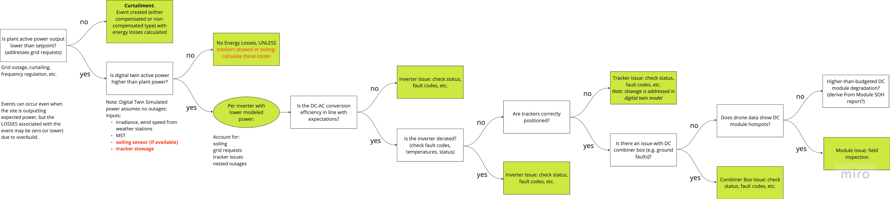

# Losses Calculation and Allocation

Energy and financial losses from events are calculated through a systematic process that accounts for overlapping issues and properly allocates losses to the appropriate root causes. The system follows a hierarchical approach to ensure accurate attribution of losses.

## Loss Calculation Process

When calculating losses for overlapping events, the system follows these key principles:

1. Hierarchical Attribution: Losses are attributed to the lowest level component in the hierarchy that is experiencing an issue
2. Temporal Segmentation: Time periods are split into segments where different combinations of events are active
3. Parent-Child Relationships: Events at higher levels (e.g., MV transformer) take precedence over downstream events during overlapping periods

### Example Scenario

Consider a situation where:
- A tracker is non-functional for 48 hours (parent event)
- During those 48 hours, an inverter downstream of that tracker fails for 6 hours (parent event)

The loss attribution would be:
- The inverter event gets 100% of losses during its 6-hour period
- The tracker event gets attributed losses for the remaining 42 hours
- No double-counting occurs during the overlap

## Systematic Diagnosis Flow

The following flowchart illustrates how the system diagnoses and categorizes performance issues to properly attribute losses:

1. Is Plant Active Power Output Lower Than Setpoint?

This initial question checks if the plant's output falls below its expected or setpoint level. If the output is lower due to external grid requests (such as curtailment or regulation), this is logged as a curtailment event, potentially impacting energy calculations if uncompensated.

2. Check for Digital Twin Discrepancies

If the plant’s active power is lower than expected, the system next compares it to a "Digital Twin" simulated power output. The digital twin uses inputs such as irradiance, wind speed, and temperature to model expected power, accounting for real-time environmental factors.
If the digital twin output is higher, it may indicate an issue within the plant rather than external factors.

3. Inverter-Level Analysis

If discrepancies persist, the system checks each inverter’s modeled power output.
Specific questions then address whether the DC-to-AC conversion efficiency is consistent with expectations and whether the inverter itself shows signs of degradation (through fault codes, elevated temperatures, or status indicators).
Any issues here are logged as "Inverter Issues," requiring further inspection.

4. Tracker Positioning and Performance

The flow checks if solar trackers are correctly positioned, as improper positioning could reduce efficiency. Any misalignment could indicate tracker issues, potentially logged based on fault codes or positioning errors.

5. Combiner Box and Module-Level Checks

The next step inspects the combiner box for faults, ground faults, or other connection issues, as faults here would impact the entire string connected to the box.
The flow also checks drone data to identify DC module hotspots, which are indications of module-level performance issues.

6. Module Degradation

If module hotspots or degradation are detected, further investigation is required to determine if degradation rates exceed budgeted expectations, suggesting a need for replacement or maintenance.

- DC or AC Overbuild: Instances where system design allows for performance variations without impacting overall energy output.
- POI Curtailment: Situations where output restrictions at the point of interconnection reduce energy production, independent of asset condition.
- Communication Issues without Operational Impact: Occurrences where data transfer is disrupted, but the asset continues functioning as expected.
- Superseding Parent Event: Certain events are grouped under a larger parent event to streamline reporting and focus on primary issues.