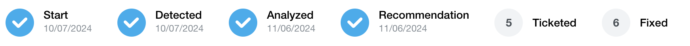

# Events

Events are technical issues occurring within the plant, triggered by factors such as underperformance, outages, or data communication problems. Each event is directly linked to a specific asset ID of a certain device type (e.g., inverter, combiner box, tracker, MV transformer) for precise identification and tracking.

Events may or may not lead to energy and revenue losses due to several considerations ([read here](event_losses.md))

## Event Stages

Events on the platform go through defined stages to ensure structured identification, analysis, and resolution. Each stage has a specific purpose and timestamp for tracking progress. Here’s an overview of each stage:

**Start**
Initial detection of a potential issue related to an asset, timestamped to mark the beginning of the event lifecycle.

**Detected**
The system confirms the presence of an issue by comparing data against preset thresholds or rules.

**Analyzed**
The platform conducts a deeper analysis to understand the root cause, classify the type of event (e.g., underperformance, outage), and assess potential impacts on energy and revenue.

**Recommendation**
Based on the analysis, a recommendation is generated for corrective action or mitigation, such as dispatching maintenance or adjusting operating parameters.

**Ticketed**
A service ticket is created to address the issue. This stage involves notifying relevant personnel, assigning responsibilities, and scheduling repairs if necessary.

**Fixed**
The issue has been resolved, and the system or asset returns to optimal performance. The event is marked as completed, and a final timestamp is recorded.

In theory, the sum of all power losses from active events should make up the difference between expected and actual power.

## Some Examples:

An inverter shuts down due to a DC ground fault, 
