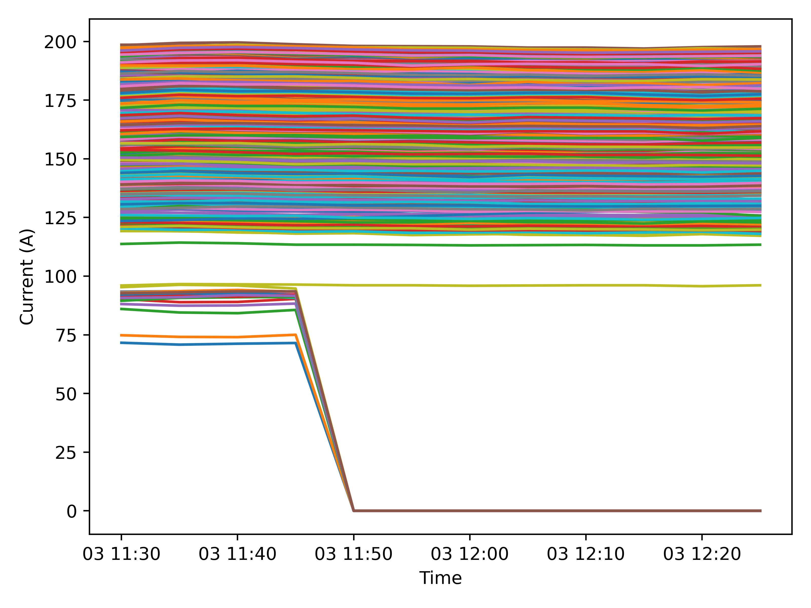
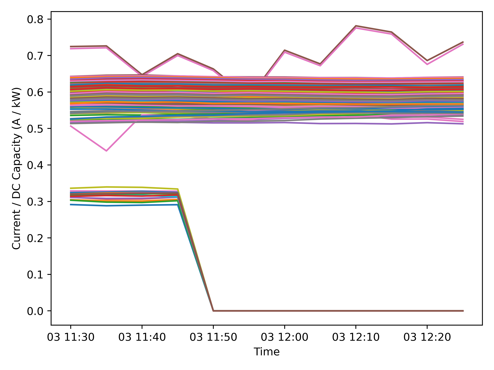
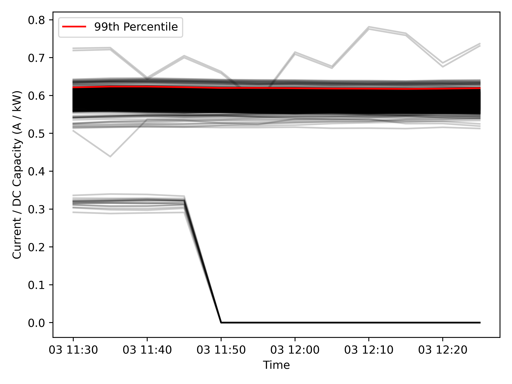
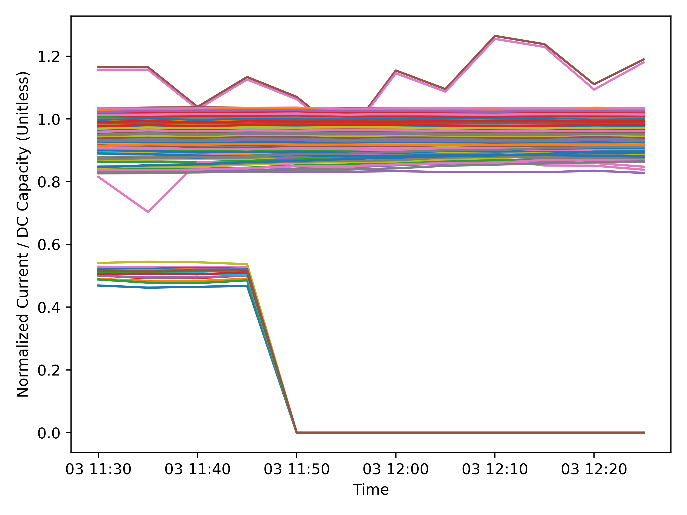
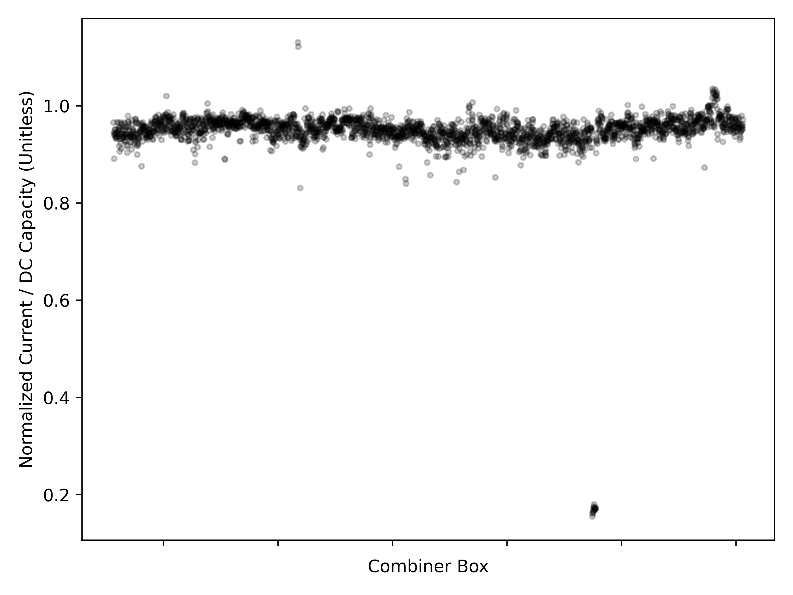
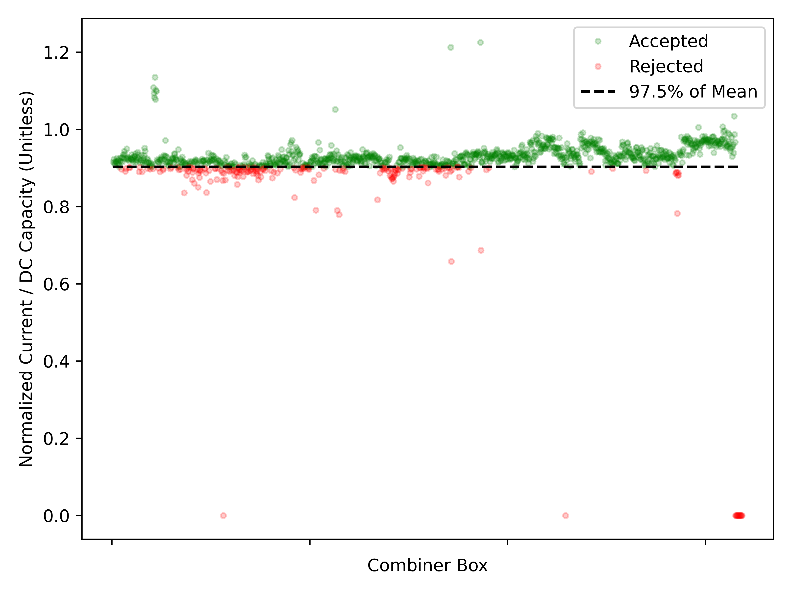

# Combiner Field Health KPI

_CONFIDENTIAL - Prepared for Longroad Energy & First Solar_

## Description

The **Combiner Field Health KPI** measures the DC health of a project based on combiner current data. Each combiner receives a daily health score ranging from 0 to 1, where a score of 1 indicates the healthiest combiners on the project.

## Methodology

1. **Retrieve DC combiner current data** for each combiner box on a 5-minute interval. The data is filtered to focus on the time window from 11:30 AM to 12:30 PM to capture peak irradiance conditions.  
   
2. **Normalize each combiner's current** against its own DC capacity to account for differences in combiner size.  
   
3. **Identify the "ideal" combiner** by calculating the 99th percentile of all normalized combiner currents. The 99% threshold is chosen to exclude outliers and focus on typical combiner performance.  
   
4. **Normalize all combiners' ratios** against the ideal combiner. This gives the ideal combiner a score of 1.0, with all other combiners having a score ranging from 0 to 1. Outliers may exceed a score of 1.0.  
   
5. **Calculate the daily mean score** of each combiner trace to calculate the overall DC Field Health for each combiner on that day.
   
6. **Calculate the mean of all combiner scores** to derive the overall DC Field Health for the project on that day.

 
For the Module State of Health report, the combiner fuse health score is used as an input to filter for combiners with a score of at least 97.5% of the mean nonzero score. For the above example day, the mean nonzero score is 0.926.

83.3% of combiners pass this filter on this day.
