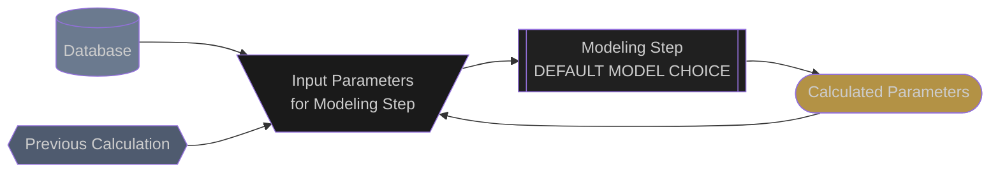

# Effective Irradiance

## General

The Effective Plane of Array Irradiance (EPOAI) is the amount of irradiance that is incident upon the active cell area of the photovoltaic array.  This is differentiated from the Plane of Array Irradiance (POAI) which is the amount of irradiance that is incident upon the front face of the photovoltaic array glass.

Conceptually, losses calculated while calculating the effective plane of array irradiance are generally calculated in the same order as the physical losses that occur between the sun's rays and t`he cell active material.  For example, soiling loss on top of the module glass is calculated before the incidence angle effect inside of the module glass.  On the other hand, some losses such as spectral correction, which are actually material science losses are calculated empirical losses in effective plane of array irradiance.

## Acronyms:
- Irradiance
  - **POAI**: Plane of Array Irradiance
-  **EPOAI**: Effective Plane of Array Irradiance


## Simulation Pipeline
The following flow diagram shows how the Effective Plane of Array Irradiance is calculated in the Proximal expected energy simulation.  The flow chart is meant to be interactive.  Clicking on any of the modeling step nodes will take you to the documentation for that modeling step.

You may need to zoom in to be able to better see all of the details in the flow chart.

### Legend


### Model Chain
```mermaid
flowchart TD

  %% --- CLASSES ---
  classDef source fill:#6B7A8F, color:#CCCCCC
  classDef previous fill:#4F5B6F,color:#CCCCCC
  classDef model fill:#202020, color:#CCCCCC
  classDef model_dashed fill:#202020, color:#CCCCCC, stroke-dasharray: 5 5
  classDef inputs fill:#1A1A1A, color:#CCCCCC
  classDef outputs fill:#B39245, color:#CCCCCC

  %% --- SOURCES ---
  met_station[(
    --- MET STATION ---
    soiling
  )]:::source
  met_station --> soiling_inputs

  pv_system[(
    --- PV Modules ---
    n
    K
    L
    n_ar
    cell_technology
  )]:::source
  pv_system --> direct_iam_inputs
  pv_system --> spectral_inputs

  tracker_params{{
    --- TRACKER PARAMS ---
    rotation_angle
    surface_tilt
    surface_azimuth
    aoi
  }}:::previous
  click tracker_params "tracker_rotation_angles.html"
  tracker_params --> direct_shade_inputs
  tracker_params --> direct_iam_inputs

  met_params{{
    --- MET PARAMS ---
    dhi
    dni
    dni_extra
    apparent_zenith
    azimuth
    airmass_relative
  }}:::previous
  click met_params "meteorological_parameters.html"
  met_params --> direct_shade_inputs
  met_params --> spectral_inputs

  poai_params{{
    --- POAI PARAMS ---
    isotropic
    horizon
    ground_diffuse
    circumsolar
    beam
  }}:::previous
  click poai_params "plane_of_array_irradiance.html"
  poai_params --> direct_shade_inputs

  %% --- Direct Shade ---
  direct_shade_inputs[\
    apparent_zenith
    azimuth
    axis_tilt
    axis_azimuth
    rotation_angle
    collector_width
    pitch
    surface_to_axis_offset
    cross_axis_slope
    shading_row_rotation
    /]:::inputs
  direct_shade_inputs --> direct_shade

  direct_shade[[
    pvlib.shading
    .shaded_fraction_1d
    ]]:::model
  click direct_shade "https://pvlib-python.readthedocs.io/en/latest/reference/generated/pvlib.shading.shaded_fraction1d.html"
  direct_shade --> direct_shade_outputs

  direct_shade_outputs([
      isotropic
      horizon
      ground_diffuse
      circumsolar - shade?
      beam - shade
    ]):::outputs
  direct_shade_outputs --> soiling_inputs

  %% --- Soiling ---
  soiling_inputs[\
    soiling_loss
    /]:::inputs
  soiling_inputs --> soiling

  soiling[[
    proximal.soiling
    RATIO
  ]]:::model
  soiling --> soiling_outputs

  soiling_outputs([
    isotropic - soil
    horizon - soil
    ground_diffuse - soil
    circumsolar - soil
    beam - soil
    ]):::outputs
  soiling_outputs --> direct_iam_inputs

  %% --- Direct IAM ---
  direct_iam_inputs[\
  aoi
  n
  K
  L
  n_ar
  /]:::inputs
  direct_iam_inputs --> direct_iam

  direct_iam[[
    pvlib.iam.physical
    PHYSICAL
  ]]:::model
  click direct_iam "https://pvlib-python.readthedocs.io/en/latest/reference/generated/pvlib.iam.physical.html"
  direct_iam --> direct_iam_outputs

  direct_iam_outputs([
      isotropic
      horizon
      ground_diffuse
      circumsolar - iam?
      beam - iam
    ]):::outputs
  direct_iam_outputs --> spectral_inputs

  %% --- Spectral ---
  spectral_inputs[\
      prcipitable_water
      airmass_absolute
      cdte_coefficients
      min_p_wat=0.1
      max_p_wat=8.0
      min_airmass_abs=0.58
      max_airmass_abs=10.0
    /]:::inputs
  spectral_inputs --> spectral

  spectral[[
    pvlib.spectral.spectral
    SPECTRAL
  ]]:::model
  spectral --> spectral_outputs

  spectral_outputs([
    isotropic - spectral
    horizon - spectral
    ground_diffuse - spectral
    circumsolar - spectral
    beam - spectral
    ]):::outputs
  spectral_outputs --> epoai_inputs

  %% --- EPOIA ---
  epoai_inputs[\
      isotropic
      horizon
      ground_diffuse
      circumsolar
      beam
      /]:::inputs
  epoai_inputs --> epoai

  epoai[[
    proximal.epoai_components
    SUM
  ]]:::model
  epoai --> epoai_outputs

  epoai_outputs([
    epoai_global
    ]):::outputs
  ```


## Edits and Additions

If you would like to see support for another algorithm or would like to suggest edits or additions to this documentation page, please open an issue on the [Proximal GitHub repository](https://github.com/ProximalEnergy/docs-mdbook).
