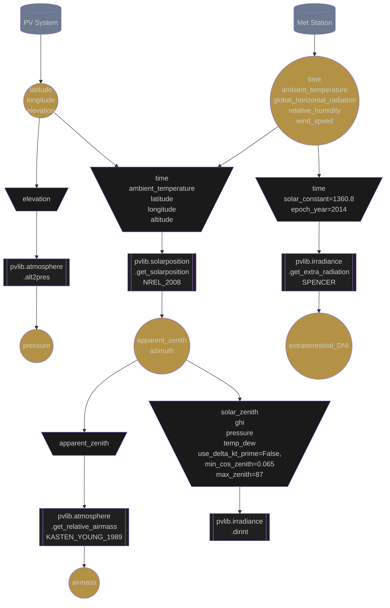

# Plane of Array Irradiance

## General

The Plane of Array Irradiance (POAI) is the amount of irradiance that is incident upon the front face of the photovoltaic array.

This section of the documentation explains all of the different models and sub-models required to calculate POAI in the order that they are calculated in the simulation.

## Acronyms:
- Irradiance
  - **DNI**: Direct Normal Irradiance
  - **extraDNI**: Extraterrestrial Direct Normal Irradiance
  - **DHI**:  Diffuse Horizontal Irradiance
  - **POAI**: Plane of Array Irradiance
- Meteorological
 - **RH**: Relative Humidity

## Edits and Additions

If you would like to see support for another algorithm or would like to suggest edits or additions to this documentation page, please open an issue on the [Proximal GitHub repository](https://github.com/ProximalEnergy/docs-mdbook).
