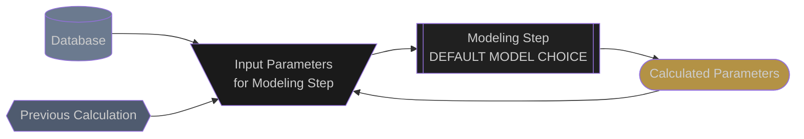

# PV Model Overview

## Why Proximal

The Proximal PV performance model has been specifically designed with operating assets in mind.  The following are a few highlights of the model that distinguish it from other PV models used in asset management.

<div class="feature-grid">
  <div class="feature-card">
    <div class="feature-icon">🔓</div>
    <h3 class="feature-title">Built on Open Source</h3>
    <p class="feature-description">
        Modern, tested, transparent, trusted by the community.  By building on top of pvlib, we can ensure that the proximal energy model is understandable by all users and easily extendable.
    </p>
  </div>

  <div class="feature-card">
    <div class="feature-icon">⑃</div>
    <h3 class="feature-title">Nodal</h3>
    <p class="feature-description">
        Expected energy can be calculated at the combiner, inverter, array, or substation level.
    </p>
  </div>

  <div class="feature-card">
    <div class="feature-icon">🕑</div>
    <h3 class="feature-title">Sub-Hourly</h3>
    <p class="feature-description">
        Operating assets emit high frequency data which is captured by the energy model.
    </p>
  </div>

  <div class="feature-card">
    <div class="feature-icon">🗺️</div>
    <h3 class="feature-title">Geospatial</h3>
    <p class="feature-description">
        Each block of the system uses the meteorological data that is closest to it which can yield great improvements for large systems with passing clouds.
    </p>
  </div>

  <div class="feature-card">
    <div class="feature-icon">📄</div>
    <h3 class="feature-title">Documented</h3>
    <p class="feature-description">
        Each step of the model is documented in detail through pvlib and through this documentation set.
    </p>
  </div>

  <div class="feature-card">
    <div class="feature-icon">♲</div>
    <h3 class="feature-title">Efficient</h3>
    <p class="feature-description">
        Inputs to each individual model are automatically factored into unique combinations.  This makes the model capable of handling large systems with high levels of detail at high frequency possible.
    </p>
  </div>
</div>


## Powered by PVLIB


### Legend


### Model Chain
```mermaid
flowchart TD

  %% --- CLASSES ---
  classDef source fill:#6B7A8F, color:#CCCCCC
  classDef model fill:#202020, color:#CCCCCC
  classDef model_dashed fill:#202020, color:#CCCCCC, stroke-dasharray: 5 5
  classDef inputs fill:#1A1A1A, color:#CCCCCC
  classDef outputs fill:#B39245, color:#CCCCCC

  subgraph Meteorological Parameters

    %% --- SOURCES ---

    pv_system[(
      --- PV SYSTEM ---
      elevation
    )]:::source
    pv_system --> calc_pressure_inputs

    met_station[(
      --- MET STATION ---
      time
      ambient_temperature
      global_horizontal_radiation
      relative_humidity
      wind_speed
      *albedo
    )]:::source
    met_station --> TDEW_inputs
    met_station --> solar_position_inputs
    met_station --> extraDNI_inputs
    met_station --> DHI_inputs

    %% --- ATMOSPHERIC PRESSURE ---
    calc_pressure_inputs[\elevation/]:::inputs
    calc_pressure_inputs --> calc_pressure

    calc_pressure[[
      pvlib.atmosphere
      .alt2pres
      ]]:::model
    calc_pressure --> calc_pressure_outputs
    click calc_pressure "https://pvlib-python.readthedocs.io/en/stable/reference/generated/pvlib.atmosphere.alt2pres.html"

    calc_pressure_outputs([
      pressure
    ]):::outputs
    calc_pressure_outputs --> DNI_inputs

    %% --- SOLAR POSITION ---
    solar_position_inputs[\
      time
      ambient_temperature
      latitude
      longitude
      altitude
    /]:::inputs
    solar_position_inputs --> solar_position

    solar_position[[
      pvlib.solarposition
      .get_solarposition
      NREL_2008
      ]]:::model
    solar_position --> solar_position_outputs
    click solar_position "https://pvlib-python.readthedocs.io/en/stable/reference/generated/pvlib.solarposition.get_solarposition.html#pvlib.solarposition.get_solarposition"

    solar_position_outputs([
      apparent_zenith
      azimuth
    ]):::outputs
    solar_position_outputs --> DNI_inputs
    solar_position_outputs --> DHI_inputs
    solar_position_outputs --> airmass_inputs

    %% --- AIRMASS ---
    airmass_inputs[\
      apparent_zenith
    /]:::inputs
    airmass_inputs --> airmass

    airmass[[
      pvlib.atmosphere
      .get_relative_airmass
      KASTEN_YOUNG_1989
    ]]:::model
    airmass --> airmass_outputs
    click airmass "https://pvlib-python.readthedocs.io/en/stable/reference/generated/pvlib.location.Location.get_airmass.html#pvlib.location.Location.get_airmass"

    airmass_outputs([
      airmass
      ]):::outputs

    %% --- EXTRATERRESTRIAL DNI ---
    extraDNI_inputs[\
    time
    solar_constant=1360.8
    epoch_year=2014
    /]:::inputs
    extraDNI_inputs --> extraDNI

    extraDNI[[
      pvlib.irradiance
      .get_extra_radiation
      SPENCER
      ]]:::model
    extraDNI --> extraDNI_outputs
    click extraDNI "https://pvlib-python.readthedocs.io/en/stable/reference/generated/pvlib.irradiance.get_extra_radiation.html#pvlib.irradiance.get_extra_radiation"

    extraDNI_outputs([
      extraterrestrial_DNI
      ]):::outputs

    %% --- TDEW ---

    TDEW_inputs[\
      relative_humidity
    /]:::inputs
    TDEW_inputs --> TDEW

    TDEW[[
      pvlib.atmosphere
      .tdew_from_rh
      MAGNUS_TETENS
      ]]:::model_dashed
    TDEW --> TDEW_outputs
    click TDEW "https://pvlib-python.readthedocs.io/en/stable/reference/generated/pvlib.atmosphere.tdew_from_rh.html#pvlib.atmosphere.tdew_from_rh"

    TDEW_outputs([
      temp_dew_point
      ]):::outputs
    TDEW_outputs --> DNI_inputs

    %% --- DNI ---

    DNI_inputs[\
      solar_zenith
      ghi
      pressure
      temp_dew
      use_delta_kt_prime=False,
      min_cos_zenith=0.065
      max_zenith=87
    /]:::inputs
    DNI_inputs --> DNI

    DNI[[
      pvlib.irradiance
      .dirint
      DIRINT
    ]]:::model
    DNI --> DNI_outputs
    click DNI "https://pvlib-python.readthedocs.io/en/stable/reference/generated/pvlib.irradiance.dirint.html#pvlib.irradiance.dirint"

    DNI_outputs([
      DNI
    ]):::outputs
    DNI_outputs --> DHI_inputs

    %% --- DHI ---
    DHI_inputs[\
      GHI
      DNI
      solar_zenith
    /]:::inputs
    DHI_inputs --> DHI

    DHI[[
      pvlib.irradiance
      .complete_irradiance
      GEOMETRIC
    ]]:::model
    DHI --> DHI_outputs
    click DHI "https://pvlib-python.readthedocs.io/en/stable/reference/generated/pvlib.irradiance.complete_irradiance.html#pvlib.irradiance.complete_irradiance"

    DHI_outputs([
      DHI
      ]):::outputs
  end
  ```


## Edits and Additions

If you would like to see support for another algorithm or would like to suggest edits or additions to this documentation page, please open an issue on the [Proximal GitHub repository](https://github.com/ProximalEnergy/docs-mdbook).
