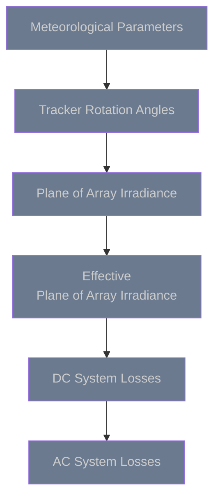

# PV Model Overview

## Why Proximal

The Proximal PV performance model has been specifically designed with operating assets in mind.  The following are a few highlights of the model that distinguish it from other PV models used in asset management.

  

    

        
    

    <h3 class="feature-title">Built on Open Source</h3>
    

        Modern, tested, transparent, trusted by the community.  By building on top of pvlib, we can ensure that the proximal energy model is understandable by all users and easily extendable.
    

  

  

    
⑃

    <h3 class="feature-title">Nodal</h3>
    

        Expected energy can be calculated at the combiner, inverter, array, or substation level.
    

  

  

    
🕑

    <h3 class="feature-title">Sub-Hourly</h3>
    

        Operating assets emit high frequency data which is captured by the energy model.
    

  

  

    
🗺️

    <h3 class="feature-title">Geospatial</h3>
    

        Each block of the system uses the meteorological data that is closest to it which can yield great improvements for large systems with passing clouds.
    

  

  

    
📄

    <h3 class="feature-title">Documented</h3>
    

        Each step of the model is documented in detail through pvlib and through this documentation set.
    

  

  

    
♲

    <h3 class="feature-title">Efficient</h3>
    

        Inputs to each individual model are automatically factored into unique combinations.  This makes the model capable of handling large systems with high levels of detail at high frequency possible.
    

  

### Model Chain
The proximal performance model at a high level is comprised of 6 major sub-models.  Clicking on any of the models will take you to the actual model steps that occur in each sub-model.

## Edits and Additions

If you would like to see support for another algorithm or would like to suggest edits or additions to this documentation page, please open an issue on the [Proximal GitHub repository](https://github.com/ProximalEnergy/docs-mdbook).
