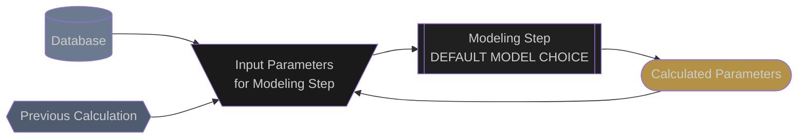

# AC System Losses

## General
AC system losses include losses that occur between the inverter and the project point of interconnection.  Combining of individual IV curves into a single IV curve and the combining of inverter current and voltage characteristics in to AC daisy chains is not shown for simplicity.


## Acronyms:
- **AC**: Alternating Current
- **I**: Current
- **P**: Power
- **POI**: Point of Interconnection
- **V**: Voltage


## Simulation Pipeline
The following flow diagram shows how AC system losses are calculated in the Proximal expected energy simulation.  The flow chart is meant to be interactive.  Clicking on any of the modeling step nodes will take you to the documentation for that modeling step.

You may need to zoom in to be able to better see all of the details in the flow chart.

### Legend


### Model Chain
```mermaid
flowchart TD

  %% --- CLASSES ---
  classDef source fill:#6B7A8F, color:#CCCCCC
  classDef previous fill:#4F5B6F,color:#CCCCCC
  classDef model fill:#202020, color:#CCCCCC
  classDef model_dashed fill:#202020, color:#CCCCCC, stroke-dasharray: 5 5
  classDef inputs fill:#1A1A1A, color:#CCCCCC
  classDef outputs fill:#B39245, color:#CCCCCC

  %% --- SOURCES ---

  iv_curve{{
    Combiner IV curves
  }}:::previous
  iv_curve --> inverter_eff_inputs

  %% --- Inverter Efficiency ---
  inverter_eff_inputs[\
    Combiner IV curves
    /]:::inputs
  inverter_eff_inputs --> inverter_eff

  inverter_eff[[
    pvlib.inverter
    .sandia
    SANDIA
  ]]:::model
  inverter_eff --> inverter_eff_outputs
  click inverter_eff "https://pvlib-python.readthedocs.io/en/stable/reference/generated/pvlib.inverter.sandia.html#pvlib.inverter.sandia"

  inverter_eff_outputs[(
    V
    P
  )]:::outputs
  inverter_eff_outputs --> transformer_eff_inputs

  %% --- Transformer ---
  transformer_eff_inputs[\
    I
    V
    /]:::inputs
  transformer_eff_inputs --> transformer_eff

  transformer_eff[[
    pvlib.transformer
    .simple_efficiency
    SIMPLE_EFFICIENCY
  ]]:::model
  transformer_eff --> transformer_eff_outputs
  click transformer_eff "https://pvlib-python.readthedocs.io/en/stable/reference/generated/pvlib.transformer.simple_efficiency.html"

  transformer_eff_outputs[/
    I
    V
    \]:::outputs
  transformer_eff_outputs --> poi_inputs

  %% --- POI ---
  poi_inputs[\
    I
    V
    /]:::inputs
  poi_inputs --> poi

  poi[[
    proximal.clipping
    SIMPLE CLIP
  ]]:::model
  poi --> poi_outputs

  poi_outputs[/
    I
    V
    \]:::outputs
  ```


## Edits and Additions

If you would like to see support for another algorithm or would like to suggest edits or additions to this documentation page, please open an issue on the [Proximal GitHub repository](https://github.com/ProximalEnergy/docs-mdbook).
