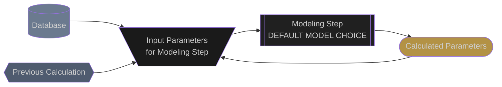

# DC System Losses

## General
DC system losses include losses that occur between the photovoltaic cell and the DC wiring to the inverter.  In the diagrams, steps for combining power into strings and into combiners has been left out for the sake of brevity.


## Acronyms:
- **DC**: Direct Current
- **EPOAI**: Effective Plane of Array Irradiance
- **i**: Current
- **v**: Voltage
- **p**: Power
- **mp**: Maximum Power
- **oc**: Open Circuit

## Simulation Pipeline
The following flow diagram shows how DC system losses are calculated in the Proximal expected energy simulation.  The flow chart is meant to be interactive.  Clicking on any of the modeling step nodes will take you to the documentation for that modeling step.

You may need to zoom in to be able to better see all of the details in the flow chart.

### Legend


### Model Chain
```mermaid
flowchart TD

  %% --- CLASSES ---
  classDef source fill:#6B7A8F, color:#CCCCCC
  classDef previous fill:#4F5B6F,color:#CCCCCC
  classDef model fill:#202020, color:#CCCCCC
  classDef model_dashed fill:#202020, color:#CCCCCC, stroke-dasharray: 5 5
  classDef inputs fill:#1A1A1A, color:#CCCCCC
  classDef outputs fill:#B39245, color:#CCCCCC

  %% --- SOURCES ---
  met_station[(
    --- MET STATION ---
    ambient temperature
    wind speed
  )]:::source
  met_station --> cell_temperature_inputs

  epoai{{
    --- EPOAI ---
    epoai
  }}:::previous
  click tracker_params "effective_plane_of_array_irradiance.html"
  epoai --> cell_temperature_inputs
  epoai --> single_diode_inputs

  %% --- Cell Temperature ---
  cell_temperature_inputs[\
    epoai
    ambient temperature
    wind speed
    /]:::inputs
  cell_temperature_inputs --> cell_temperature

  cell_temperature[[
    pvlib.temperature
    .pvsyst_cell
    PVSYST_CELL
    ]]:::model
  cell_temperature --> cell_temperature_outputs
  click cell_temperature "https://pvlib-python.readthedocs.io/en/stable/reference/generated/pvlib.temperature.pvsyst_cell.html#pvlib.temperature.pvsyst_cell"

  cell_temperature_outputs([
    cell_temperature
    ]):::outputs
  cell_temperature_outputs --> single_diode_inputs

  %% --- Single Diode Model ---
  single_diode_inputs[\
    epoai
    cell temperature
    module parameters
    /]:::inputs
  single_diode_inputs --> single_diode

  single_diode[[
    pvlib.pvsystem
    .calcparams_desoto
    DESOTO
    ]]:::model
  click single_diode "https://pvlib-python.readthedocs.io/en/stable/reference/generated/pvlib.pvsystem.calcparams_desoto.html#pvlib-pvsystem-calcparams-desoto"
  single_diode --> single_diode_outputs

  single_diode_outputs([
    single diode parameters
  ]):::outputs
  single_diode_outputs --> iv_inputs

  %% --- IV Curve ---
  iv_inputs[\
    single diode parameters
    /]:::inputs
  iv_inputs --> iv

  iv[[
    pvlib.pvsystem
    .singlediode
    ]]:::Model
  click iv "https://pvlib-python.readthedocs.io/en/stable/reference/generated/pvlib.pvsystem.singlediode.html#pvlib.pvsystem.singlediode"
  iv --> iv_outputs

  iv_outputs([
    iv_curve
  ]):::outputs
  iv_outputs --> degradation_inputs

  %% --- Degradation ---
  degradation_inputs[\
    iv_curve
    /]:::inputs
  degradation_inputs --> degradation

  degradation[[
    proximal.degradation
    RATIO
  ]]:::model
  degradation --> degradation_outputs

  degradation_outputs([
    iv_curve
  ]):::outputs
  degradation_outputs --> wiring_inputs

  %% --- DC Wiring to Combiner ---
  wiring_inputs[\
    iv_curve
    /]:::inputs
  wiring_inputs --> wiring

  wiring[[
    proximal.target_stc
    TARGET LOSS AT STC
    ]]:::model
  wiring --> wiring_outputs

  wiring_outputs([
    iv_curve
  ]):::outputs


  ```


## Edits and Additions

If you would like to see support for another algorithm or would like to suggest edits or additions to this documentation page, please open an issue on the [Proximal GitHub repository](https://github.com/ProximalEnergy/docs-mdbook).
