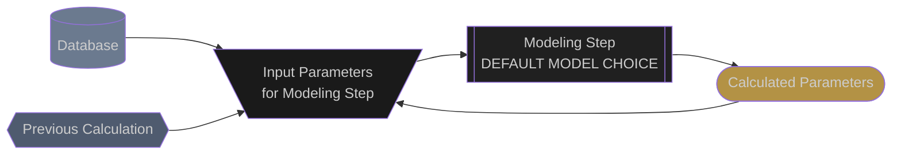

# Plane of Array Irradiance

## General

The Plane of Array Irradiance (POAI) is the amount of irradiance that is incident upon the front face of the photovoltaic array.

This section of the documentation explains all of the different models and sub-models required to calculate POAI in the order that they are calculated in the simulation.

## Switching Behavior

The Proximal Performance Model behaves different from other performance modeling software the user may be familiar with.  It automatically switches between using the POA sensor as the input to the POA components model and the GHI sensor as the input to the POA components model.  The model does this to account for the tendency of POA sensors to get shaded by nearby racks and become out of position due to tracking faults.  When the predicted POA from the GHI sensor is greater than ten percent above the measured POA data, then the decomposed and transposed components from the GHI sensor are used for the rest of the model.  This behavior is then noted in the data stream as lower quality data.

## Acronyms:
- **extraDNI**: Extraterrestrial Direct Normal Irradiance
- **DNI**: Direct Normal Irradiance
- **DHI**:  Diffuse Horizontal Irradiance
- **RHI**:  Reflected Horizontal Irradiance
- **POAI**: Plane of Array Irradiance


## Simulation Pipeline
The following flow diagram shows how the Plane of Array Irradiance is calculated in the Proximal expected energy simulation.  The flow chart is meant to be interactive.  Clicking on any of the modeling step nodes will take you to the documentation for that modeling step.

You may need to zoom in to be able to better see all of the details in the flow chart.

### Legend


### Model Chain
```mermaid
flowchart TD

  %% --- CLASSES ---
  classDef source fill:#6B7A8F, color:#CCCCCC
  classDef previous fill:#4F5B6F,color:#CCCCCC
  classDef model fill:#202020, color:#CCCCCC
  classDef model_dashed fill:#202020, color:#CCCCCC, stroke-dasharray: 5 5
  classDef inputs fill:#1A1A1A, color:#CCCCCC
  classDef outputs fill:#B39245, color:#CCCCCC

  %% --- SOURCES ---
  met_station[(
    --- MET STATION ---
    ghi
  )]:::source
  met_station --> ground_diffuse_inputs

  tracker_params{{
    --- TRACKER PARAMS ---
    tracker_rotation_angle
    tracker_surface_tilt
    tracker_surface_azimuth
    aoi
  }}:::previous
  click tracker_params "tracker_rotation_angles.html"
  tracker_params --> sky_diffuse_inputs
  tracker_params --> ground_diffuse_inputs
  tracker_params --> beam_inputs

  met_params{{
    --- MET PARAMS ---
    dhi
    dni
    dni_extra
    apparent_zenith
    azimuth
    airmass_relative
  }}:::previous
  met_params --> sky_diffuse_inputs
  met_params --> beam_inputs
  click met_params "meteorological_parameters.html"

  %% --- Ground Diffuse ---
  ground_diffuse_inputs[\
    surface_tilt
    ghi
    albedo
    /]:::inputs
  ground_diffuse_inputs --> ground_diffuse

  ground_diffuse[[
    pvlib.irradiance
    .ground_diffuse
    GEOMETRIC
    ]]:::model
  ground_diffuse --> ground_diffuse_outputs
  click ground_diffuse "https://pvlib-python.readthedocs.io/en/stable/reference/generated/pvlib.irradiance.get_ground_diffuse.html"

  ground_diffuse_outputs([
    ground_diffuse
    ]):::outputs
  ground_diffuse_outputs --> poai_inputs

  %% --- Sky Diffuse ---
  sky_diffuse_inputs[\
    surface_tilt
    surface_azimuth
    dhi
    dni
    dni_extra
    apparent_zenith
    azimuth
    airmass_relative
    /]:::inputs
  sky_diffuse_inputs --> sky_diffuse

  sky_diffuse[[
    pvlib.irradiance
    .perez_driesse
    POAI
  ]]:::model
  sky_diffuse --> sky_diffuse_outputs
  click sky_diffuse "https://pvlib-python.readthedocs.io/en/stable/reference/generated/pvlib.irradiance.perez_driesse.html#pvlib.irradiance.perez_driesse"

  sky_diffuse_outputs([
    isotropic
    horizon
    circumsolar
    ]):::outputs
  sky_diffuse_outputs --> poai_inputs

  %% --- BEAM ---
  beam_inputs[\
    surface_tilt
    surface_azimuth
    solar_zenith
    solar_azimuth
    dni
    /]:::inputs
  beam_inputs --> beam

  beam[[
    pvlib.irradiance
    .beam_component
    GEOMETRIC
    ]]:::model
  beam --> beam_outputs
  click beam "https://pvlib-python.readthedocs.io/en/stable/reference/generated/pvlib.irradiance.beam.html"

  beam_outputs([
    beam
    ]):::outputs
  beam_outputs --> poai_inputs

  %% --- POAI ---
  poai_inputs[\
    isotropic
    circumsolar
    horizon
    ground_diffuse
    beam
    /]:::inputs
  poai_inputs --> poai

  poai[[
    proximal.poai_components
    SUM
  ]]:::model
  poai --> poai_outputs


  poai_outputs([
    poai_global
    ]):::outputs
  ```


## Edits and Additions

If you would like to see support for another algorithm or would like to suggest edits or additions to this documentation page, please open an issue on the [Proximal GitHub repository](https://github.com/ProximalEnergy/docs-mdbook).
