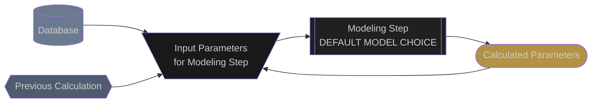

# Tracker Rotation Angles

## Acronyms:
- Tracking
 - **aoi**: Angle of Incidence

### Legend


### Model Chain
```mermaid
  flowchart TD

  classDef source fill:#6B7A8F, color:#CCCCCC
  classDef previous fill:#4F5B6F,color:#CCCCCC
  classDef model fill:#202020, color:#CCCCCC
  classDef model_dashed fill:#202020, color:#CCCCCC, stroke-dasharray: 5 5
  classDef inputs fill:#1A1A1A, color:#CCCCCC
  classDef outputs fill:#B39245, color:#CCCCCC

  %% --- Data Sources ---
  met_params{{
    --- MET PARAMS ---
    apparent_zenith
    azimuth
  }}:::previous
  met_params --> tracker_rotation_angles_inputs
  click met_params "meteorological_parameters.html"

  pv_system[(
    --- PV SYSTEM ---
    tracker_tilt
    tracker_azimuth
    tracker_max_angle
    tracking_type
    gcr
  )]:::source
  pv_system --> tracker_rotation_angles_inputs

  %% --- Tracker Rotation Angles ---
  tracker_rotation_angles_inputs[\
    apparent_zenith
    azimuth
    tracker_tilt
    tracker_azimuth
    tracker_max_angle
    tracking_type
    gcr
    /]:::inputs
  tracker_rotation_angles_inputs --> tracker_rotation_angles

  tracker_rotation_angles[[
    pvlib.tracking
    .single_axis
    ANDERSON_MIKOFSKI_2020
    ]]:::model
  tracker_rotation_angles --> tracker_rotation_angles_outputs
  click tracker_rotation_angles "https://pvlib-python.readthedocs.io/en/stable/reference/generated/pvlib.tracking.singleaxis.html#pvlib.tracking.singleaxis"

  tracker_rotation_angles_outputs([
    tracker_rotation_angle
    surface_tilt
    surface_azimuth
    aoi
    ]):::outputs
  ```

## Edits and Additions

If you would like to see support for another algorithm or would like to suggest edits or additions to this documentation page, please open an issue on the [Proximal GitHub repository](https://github.com/ProximalEnergy/docs-mdbook).
