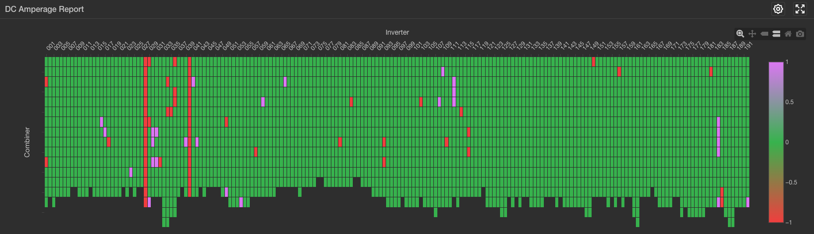

# DC Amperage Report
## Overview

This report shows the normalized current at every combiner at the PV power plant filtered for clear sky conditions.  Combiner current is normalized based off of the nameplate capacity of each combiner.  This makes it so that combiners with different amounts of dc capacity can be compared against one another on an apples-to-apples basis.

Different combiners may have different capacity due to differences in the number of strings attached to each combiner, or different module bins, etc.

## Filters
The analysis is generated with user input for clearsky data on a given day.

## How to Read This Report
Combiners in green are performing

## Caveats
- There must be at least one cleary-sky period during the day for this report to generate.
- If the system definition is incorrect, (for example if the DC capacity reported to Proximal during commissioning was incorrect) then the report will be incorrect for those combiners which are defined incorrectly since the combiner DC capacity is used in the normalization calculation.
